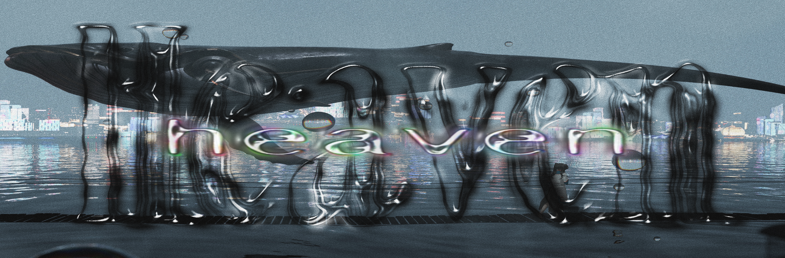
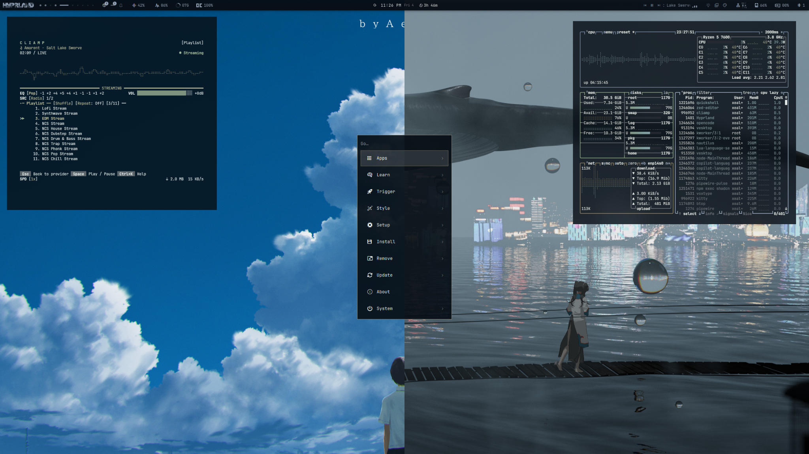
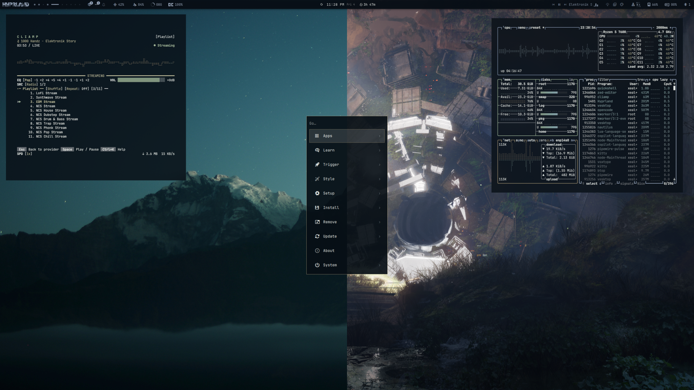

```bash
omarchy theme install https://github.com/Malte-Dzierzon/omarchy-haven-theme.git
```




<details>
<summary>Wallpapers — Landscapes</summary>


`01-summer-cloud`


`02-whale-abyss`


`04-mountain-mirror`


`07-stardust-peaks`


`08-rain-study`


`10-neon-haven`


`12-sky-leviathans`


`15-meadow-path`


`16-frosthold`

</details>

<details>
<summary>Wallpapers — Anime</summary>


`05-bedroom-anime`


`06-cave-light`


`09-sunflower-girl`


`11-storm-mage`


`13-amber-gaze`


`14-tavern-treat`

</details>

<details>
<summary><b>Palette</b></summary>

| Swatch | Token | Hex |
|---|---|---|
|  | `background` | `#070e15` |
|  | `foreground` | `#e9efeb` |
|  | `accent` / `blue` | `#97a6bb` |
|  | `muted` | `#62676c` |
|  | `lighter_background` | `#20262c` |
|  | `red` | `#857960` |
|  | `green` | `#82967f` |
|  | `yellow` | `#96937b` |
|  | `cyan` | `#83a2a3` |
|  | `magenta` | `#6c7b91` |

Full palette in [`colors.toml`](colors.toml). Dark mode only.

</details>

<details>
<summary><b>Included configurations</b></summary>

This theme includes configurations for:

- Alacritty (`alacritty.toml`)
- btop (`btop.theme`)
- Cava (`cava_theme`)
- Chromium (`chromium.theme`)
- Foot (`foot.ini`)
- Ghostty (`ghostty.conf`)
- GTK (`gtk.css`)
- Icons (`icons.theme`)
- Kitty (`kitty.conf`)
- Mako (`mako.ini`)
- Neovim (`neovim.lua`)
- Omarchy shell (`shell.toml`, `colors.toml`)
- SwayOSD (`swayosd.css`)
- VSCode (`vscode.json`)
- Walker (`walker.css`)
- Warp (`warp.yaml`)
- Zed (`aether.zed.json`)
- Zellij (`zellij.kdl`)

</details>

---

## License

MIT — see [LICENSE](LICENSE). Theme code is yours to use and remix.

Wallpapers are **not mine** — sourced from wallhaven.cc, for personal use only. All credit belongs to the original artists.
