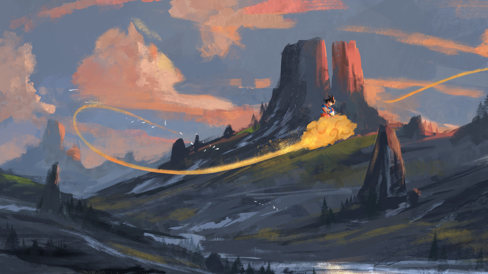
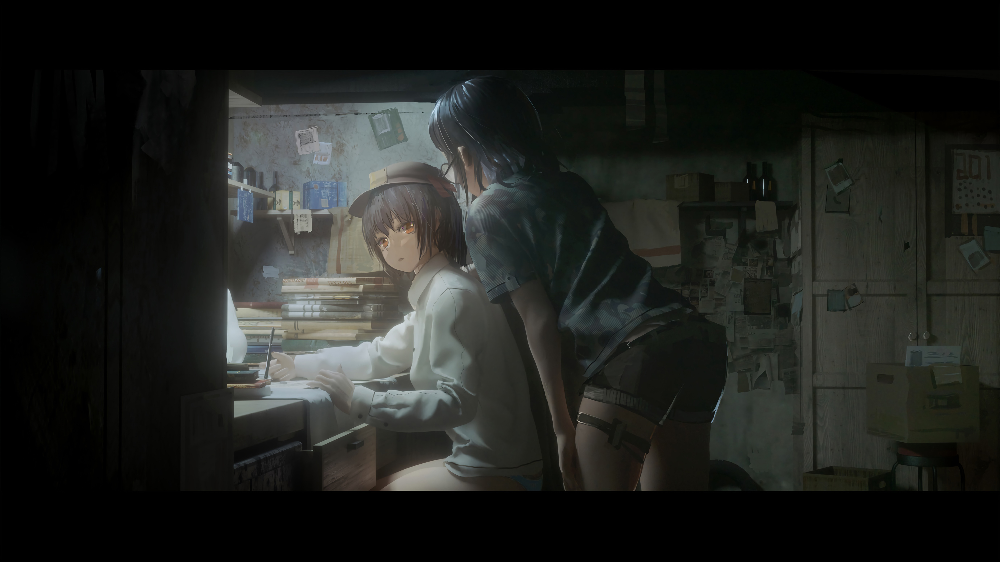
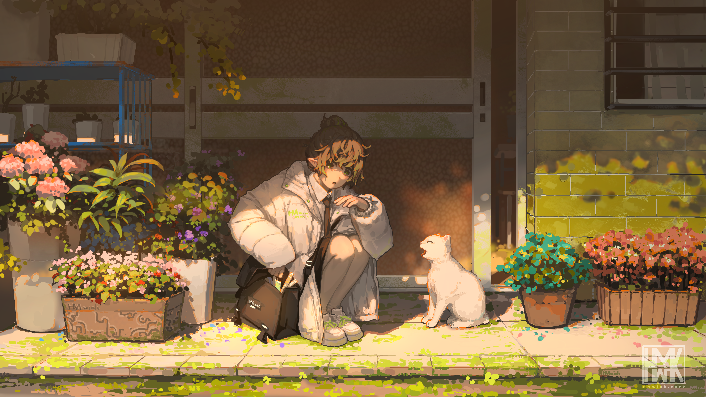
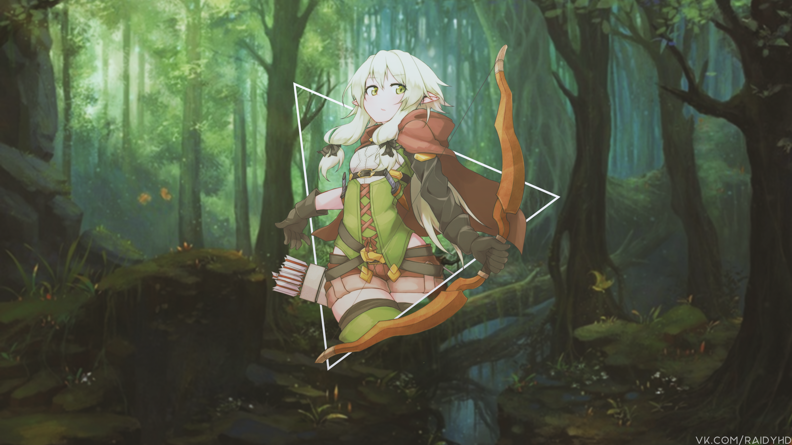
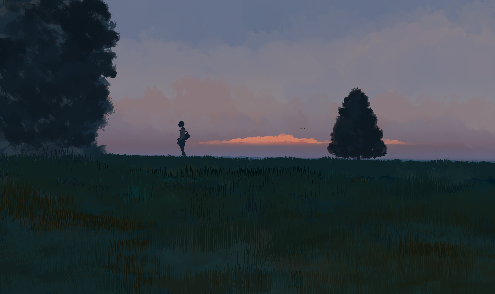

# Haven

<br>

```bash
omarchy theme install https://github.com/<user>/omarchy-haven-theme.git && omarchy theme set haven
```


> Screenshots double as wallpapers — replace with real desktop shots later if you like.

<details>
<summary><b>Wallpapers</b></summary>

| | | |
|---|---|---|
|  `01-foggy-forest` |  `02-whale-abyss` |  `03-canyon-drift` |
|  `04-mountain-mirror` |  `05-bedroom-anime` |  `06-cave-light` |
|  `07-stardust-peaks` |  `08-rain-study` |  `09-garden-cat` |
|  `10-cavern-core` |  `11-summer-cloud` |  `12-forest-archer` |
|  `13-dusk-field` | | |

Cycle with `omarchy theme bg next`.

</details>

<details>
<summary><b>Palette</b></summary>

| Swatch | Token | Hex |
|---|---|---|
|  | `background` | `#070e15` |
|  | `foreground` | `#b1d2d2` |
|  | `accent` / `blue` | `#97a6bb` |
|  | `muted` | `#62676c` |
|  | `lighter_background` | `#20262c` |
|  | `red` | `#857960` |
|  | `green` | `#70806c` |
|  | `yellow` | `#96937b` |
|  | `cyan` | `#83a2a3` |
|  | `magenta` | `#6c7b91` |

Full palette in [`colors.toml`](colors.toml). Dark mode only.

</details>

<details>
<summary><b>Included configurations</b></summary>

This theme includes configurations for:

- Alacritty (`alacritty.toml`)
- btop (`btop.theme`)
- Cava (`cava_theme`)
- Chromium (`chromium.theme`)
- Foot (`foot.ini`)
- Ghostty (`ghostty.conf`)
- GTK (`gtk.css`)
- Hyprland (`hyprland.conf`, `hyprland.lua`, `hyprlock.conf`)
- Icons (`icons.theme`)
- Kitty (`kitty.conf`)
- Mako (`mako.ini`)
- Neovim (`neovim.lua`)
- Omarchy shell (`shell.toml`, `colors.toml`)
- SwayOSD (`swayosd.css`)
- Vencord / Vesktop (`vencord.theme.css`)
- VSCode (`vscode.json`)
- Walker (`walker.css`)
- Warp (`warp.yaml`)
- Waybar (`waybar.css`)
- Wofi (`wofi.css`)
- Zed (`aether.zed.json`)
- Zellij (`zellij.kdl`)
- Several Desktop Backgrounds (`backgrounds/`)

</details>
