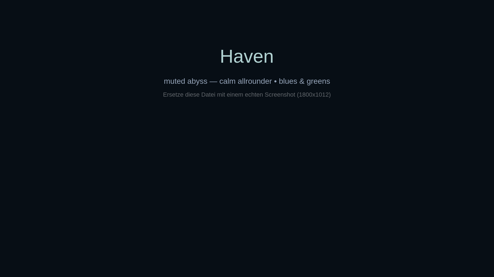

# Haven — Omarchy Theme

> **Muted abyss. Calm allrounder for everyday use.**
> Desaturated blues & greens, foggy forests, mirrored mountains and stardust peaks — angenehm für den Alltag, nicht aufdringlich, überall stimmig.



**Repo:** `omarchy-haven-theme` → installiert als `haven` via `omarchy theme install`

### Palette

| Token | Hex | Use |
|---|---|---|
| `background` | `#070e15` | Almost black teal |
| `foreground` | `#b1d2d2` | Frosted cyan |
| `accent` | `#97a6bb` | Muted slate blue (borders, highlights) |
| `muted` | `#62676c` | Secondary |
| `lighter_bg` | `#20262c` | Elevated surface |
| `red` | `#857960` | Desaturated warm |
| `green` | `#70806c` | Moss |
| `yellow` | `#96937b` | Pale olive |
| `blue` | `#97a6bb` | = accent |
| `magenta` | `#6c7b91` | Dusty violet |
| `cyan` | `#83a2a3` | Teal |

Dark mode only (`mode = "dark"`). Alle Farben sehr düşük-saturiert — low eye-strain, passt zu allen 13 Backgrounds.

Vollständige Palette in [`colors.toml`](colors.toml).

### What's included

- `colors.toml` — canonical Omarchy palette (wird via templates zu Alacritty/Foot/Ghostty/Kitty/Neovim/Hyprland/etc. generiert)
- `backgrounds/` — 13 Bilder, alle blau-grün abgestimmt aber divers (Allrounder-Mix):
  ```text
  01-foggy-forest.jpg      - Nebelwald, herbstlich, foggy (dein Hero-Bild)
  02-whale-abyss.jpg       - Schwebender Wal über City, dystopisch, teal-grey
  03-canyon-drift.jpg      - Goku/Canyon Sunset (einziger warmer Break - optional)
  04-mountain-mirror.jpg   - Berg spiegelt sich im See, Mond
  05-bedroom-anime.png     - Cozy anime bedroom, cluttered
  06-cave-light.jpg        - Höhle mit Lichtschacht, Scifi-Ring
  07-stardust-peaks.png    - Sternenberge nachts, Schnee
  08-rain-study.jpg        - Regenfenster, Junge lernt
  09-garden-cat.png        - Mädchen mit weißer Katze, Blumen
  10-cavern-core.png       - Overgrown cavern core
  11-summer-cloud.png      - Mädchen vor riesiger Cumulus-Wolke, Sommerblau
  12-forest-archer.png     - Elf-Bogenschützin im Wald
  13-dusk-field.jpg        - Silhouette Feld Sonnenuntergang, nebelig
  omarchy.png              - kleines Logo für den Switcher
  ```
  Alle mit original Extension behalten, nur nummeriert + semantisch benannt. `omarchy theme bg next` cycliert durch.
- `icons.theme` — `Yaru-blue` (passt perfekt zu slate-teal)
- `btop.theme`, `chromium.theme` — angepasst auf Haven
- `preview.png` / `preview-unlock.png` / `unlock.png` — Platzhalter, ersetze mit echtem Screenshot (`omarchy capture` oder `SUPER + SHIFT + P`)
- `extras/` — optional: `alacritty.toml`, `kitty.conf` etc. und `waybar.css`, `wofi.css`, `zed`, `zellij` etc. Diese werden bei `omarchy theme install` **gedroppt/regeneriert**, deshalb nicht im Root. Wer sie lokal will: manuell aus `extras/` kopieren.

### Install

**Via Omarchy (empfohlen, GitHub):**

```bash
# 1. Repo auf GitHub pushen als omarchy-haven-theme
# 2. Auf Omarchy:
omarchy theme install https://github.com/<user>/omarchy-haven-theme.git
omarchy theme set haven
omarchy theme bg next   # durch Backgrounds cyclen
```

Das Repo **muss** `omarchy-haven-theme` heißen (Konvention). `omarchy theme install` strippt `omarchy-` + `-theme` → `haven`.

**Manuell lokal:**

```bash
mkdir -p ~/.config/omarchy/themes
cp -r omarchy-haven-theme ~/.config/omarchy/themes/haven
omarchy theme set haven
```

### Anpassen

Alle Farben in `colors.toml` ändern, dann neu setzen:

```bash
# nach Edit:
omarchy theme set haven
```

Weitere App-Tweaks via `~/.config/omarchy/themed/*.tpl` Overrides möglich (siehe `omarchy.org/manual/making-your-own-theme`).

Icons wechseln: `icons.theme` editieren (z.B. `Yaru-blue`, `Yaru-sage`, `Yaru-gray`).

Bar Transparenz/Spacing: `shell.toml` im Theme-Root anlegen (siehe `/usr/share/omarchy/default/themed/shell.toml.tpl`).

### Screenshots ersetzen

```bash
# Echten Preview generieren:
omarchy capture screenshot   # oder Hyprshot
# Dann nach preview.png kopieren (1800x1012 empfohlen, wie stock themes)
# Und für Lockscreen:
omarchy plymouth preview    # erstellt preview-unlock.png
```

Aktuelle `preview.png` ist nur Platzhalter.

### Extras

Der Ordner `extras/` enthält deine alten `alacritty.toml`, `foot.ini`, `ghostty.conf`, `kitty.conf`, `neovim.lua`, `hyprland.conf`, `waybar.css`, `wofi.css`, `walker.css`, `mako.ini`, `vencord`, `warp.yaml`, `zellij.kdl`, `zed` etc. Diese sind **nicht nötig** für `omarchy theme install` — sie werden automatisch aus `colors.toml` generiert. Lass sie im Repo nur dort, dokumentiere sie falls du sie teilen willst.

### Credits

- Palette von dir, generiert mit [Aether](https://github.com/bjarneo/aether) & manuell verfeinert
- Backgrounds aus wallhaven.cc (IDs in git history bzw. alt: 1pk73w, 5w2wz9 etc.) — bitte Lizenzen der Original-Artists beachten wenn du das Theme public machst
- Omarchy: https://omarchy.org

### Lizenz

MIT — siehe [LICENSE](LICENSE).

### Warum "Haven"?

Nicht nur blau-grün, nicht nur ein Motiv. 13 Bilder querbeet — Wald, Berge, City, Anime, Scifi, Himmel — aber alle im gleichen gedämpften Teal-Slate-Ton. `haven` = Zuflucht, calm, angenehm für Alltag. Kein knalliges Gamer-Theme, kein ultra-dark Hacker — einfach ein täglicher Rückzugsort. Passt zu Omarchy Nomen wie `catppuccin`, `everforest`, `nord`.

---

**Before → After**

- `omarchy-blue-green-theme` (generisch, 93M, wallhaven Namen, 22 files bloat) →
- `omarchy-haven-theme` (`haven`, 13x `01-..` semantisch, 6 core files + extras, clean `colors.toml`, previews, README)
